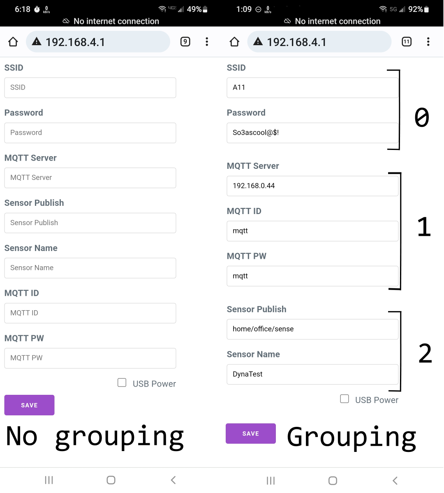
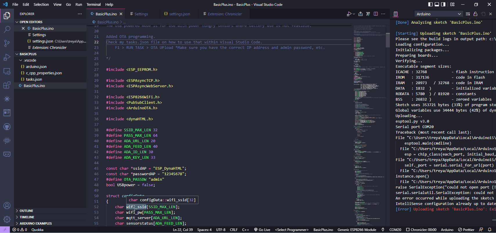

# dynaHTML

Dynamic HTML is a dynamic form generator. After designing a few sensors and project around an ESP8266, I decided to turn my hard coded html into this.

Currently I've only tested on the esp8266 series, but should work on esp32. Again, untested at this point.

Since it is manipulating the Configuration struct, you could update the callback to save to an alternate location. I've only testing using the EEPROM but since the class only updates the pointer to the configuration data and your callback saves the info, I imagine any storage could be used.

I created another project where I used Milligram (https://milligram.io/) for my style. Its a small framework, but to include it as a string in this project, I extracted only the parts I needed for the form fields I'm using.

The MenuItem struct has the option for grouping. If you add grouping, it will place the items in their own fieldset section, giving a small amount of space between sections. Not required but you can see the difference in the image below.



## Basic.ino

On first run, the example looks for a couple magic numbers in the EEPROM. If those don't exist, it assumes first run and goes straight to configuration mode. If you make a mistake and it can't connect, turn off esp, hold gpio4 low, then turn on. It will then boot into config mode.

While in Config mode, the built_in led will fade on and off.

In run mode, it will post an incremental number to the mqtt topic.

All code was tested on ESP 12-F modules as well as nodemcu.

TODO:

- Account for not setting up the call back and throw an error.
- I should also add checks for other things not setup.

# Example

## Include

```
#include <dynaHTML.h>

dynaHTML dHTML;
```

## Setup your form fields with this structure

##### This structure is a part of the Library, just use it like below to create your _MenuItem_ list.

```
typedef struct
{
  char id[MAX_ID_LEN + 1];
  char displayName[MAX_DISPLAY_NAME_LEN + 1];
  char *pdata;
  HTML_ELEMENT HT_EM;
  uint8_t group;
} MenuItem;
```

```
MenuItem mallItem[] = {{"wiid", "SSID", MyconfigData.wifi_ssid, e_INPUT, 0},
                       {"wipw", "Password", MyconfigData.wifi_pw, e_INPUT, 0},
                       {"msrv", "MQTT Server", MyconfigData.mqtt_server, e_INPUT, 1},
                       {"ss", "Sensor Publish", MyconfigData.sensorstatus, e_INPUT, 2},
                       {"sn", "Sensor Name", MyconfigData.sensorname, e_INPUT, 2},
                       {"mqi", "MQTT ID", MyconfigData.mqtt_id, e_INPUT, 1},
                       {"mqp", "MQTT PW", MyconfigData.mqtt_key, e_INPUT, 1},
                       {"powr", "USB Power", MyconfigData.usb_power, e_CHECK, 2}};
uint16_t NUM_MENU_ITEMS = sizeof(mallItem) / sizeof(MenuItem);
```

## Add your call back for when you submit your web form.

This is where you could save the data to an alternate location(spiffs, SD).

```
void dynaCallback()
{
    Serial.println(MyconfigData.wifi_ssid);
    Serial.println(MyconfigData.wifi_pw);
    Serial.println(MyconfigData.mqtt_server);
    Serial.println(MyconfigData.sensorname);
    Serial.println(MyconfigData.sensorstatus);
    Serial.println(MyconfigData.mqtt_id);
    Serial.println(MyconfigData.mqtt_key);
    Serial.println(MyconfigData.usb_power);
    saveconfigtoEE(MyconfigData);
    // if we are updating data, force a refresh of the BSSID
    MyAPdata.crc32 = 8675309;
    saveAPEE(MyAPdata);
    delay(1000);
    ESP.restart();
}
```

## Setup your Web server to use the callback and handle the HTML requests.

```
        WiFi.mode(WIFI_AP_STA);
        WiFi.softAP(ssidAP, passwordAP);

        dHTML.setCallback(dynaCallback);
        uint16_t tot = dHTML.setMenuItems(mallItem, NUM_MENU_ITEMS);

        server.on("/", HTTP_GET, [](AsyncWebServerRequest *request)
                  { dHTML.handleRequest(request); });

        server.begin();
```

See image above for an example of the HTML that is displayed upon connecting to your newly created Web Server.

# Tech used

- Save struct data to eeprom
- Use a class to deal with struct data and dynamically generate the text box or check box. Also generates the javascript to save the data.
- Work with a _callback_ from a cpp class.
- Use an ESP8266 as a Web Server to process your form fields.
- [Basic.ino](./examples/Basic/Basic.ino) example shows how to use this in real world scenario, setup WIFI data, save to eeprom, reboot, load and connect to wifi and mqtt.
- Also saves BSSID from wifi, to allow connection times from a typical 3-5 seconds to less than 500ms on my internal mosquito Home assistance instance.
- Use a input pin GPIO4 pulled low to manually force setup mode for those oops moments of typing wrong SSID.
- OH! Over the Air (OTA) programing in Visual Studio Code (VSC). I created a task which allows me to use OTA, works great. See **[tasks.json](./.vscode/tasks.json)** and adjust for your devices IP. Also see below.
- Serial Programming from a task. Have you ever compiled your code and left your Serial terminal running(YAT!)? Now the code you just waited for what seems like forever to compile to tell you the serial port is denied access.. So I created a task to send the just compiled code to the micro-controller. See **[tasks.json](./.vscode/tasks.json)** and adjust for your devices COM PORT. Also see below.

# Versions

- 1.2.4 04/18/2022 Added e_PASS type for input type="password"
  - {"wipw", "Password", MyconfigData.wifi_pw, e_INPUT, 0}
  - =_becomes_=
  - {"wipw", "Password", MyconfigData.wifi_pw, e_PASS, 0},
- 1.2.3 04/13/2022 Basically change the properties file to match versions.
- 1.2.2 04/13/2022 Added check for NUM_MENU_ITEMS == 0
- 1.2.1 04/05/2022 Cleaned up Code/Removed Serial Print!.
- 1.2.0 04/02/2022 Converted to a class

# This would not be possible without learning from or using some of these projects.

- **WifiManager Lite** by Khoi Hoang https://github.com/khoih-prog/ESP_WiFiManager_Lite
- **Milligram -** _A minimalist CSS framework_ https://milligram.io/
- **ESP8266 WiFi power reduction** https://www.bakke.online/index.php/2017/06/24/esp8266-wifi-power-reduction-avoiding-network-scan/
- **Dracula** _theme for Visual Studio Code_ https://draculatheme.com/

# Resources

- **Installing a Library** https://www.baldengineer.com/installing-arduino-library-from-github.html
- **Running Tasks** https://code.visualstudio.com/docs/editor/tasks

# COM PROGRAMMING

Have you ever clicked Upload... and you get the access denied to COM port because you forget to shut down the Serial Monitor? Instead of doing a recompile, do this. The compiled code is still there. At least it is on my setup. Maybe because in my arduino.json file I specify the output location to be in its own subfolder.
**Make sure your .ino file is active when running COM Upload** otherwise it will try to upload the currently active file.


# OTA PROGRAMMING

Visual Studio Code does not have a built in OTA programming option like the Arduino IDE. It can be added by adding a task. Grab my task.json file and modify for your esp, port and password.
**Make sure your .ino file is active when running OTA Upload** otherwise it will try to upload the currently active file.


# THANK YOU

Trey

[](https://ko-fi.com/Q5Q510IO8)
